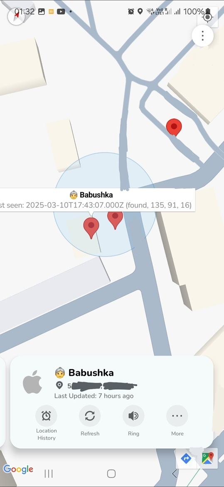

# OpenTagViewer

My **Heavily WIP** attempt at making AirTag tracking available via a Map-based UI (like that of iOS FindMy or Samsung SmartThings) on Android via this great project: **[FindMy.py](https://github.com/malmeloo/FindMy.py)**

Android (Java) + Python via Chaquopy

Currently this is not really usable yet due to lack of features & polish (it only shows the icons on the map and refreshes them in specific scenarios or on the manual refresh button click).

In the future it might become practically usable, in which case I will do my best to make it easily available/installable.

### Sneak-peak current state:

### Credits

UI Icons by Google: https://fonts.google.com/icons?icon.query=warn&icon.set=Material+Icons

Material theme colors by Google: http://material-foundation.github.io?primary=%23F4FEFF&bodyFont=Nunito&displayFont=Nunito+Sans&colorMatch=false

-----------------------

## Sections to be added/moved/etc...:

#### Notes

It would be nice if `fetch_last_reports` in `FindMy.py` could support fetching reports in smaller time ranges than hours. For example, I can cache historical results, but I would be interested in getting recent data only.
