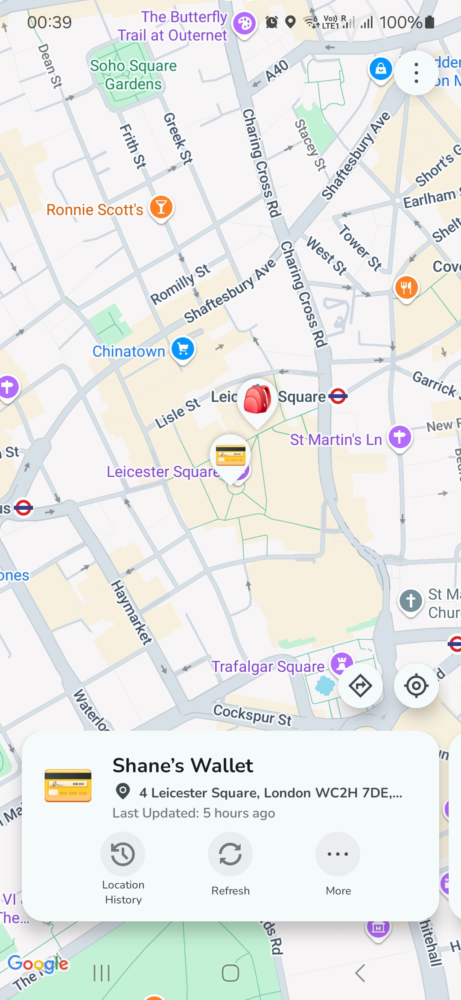
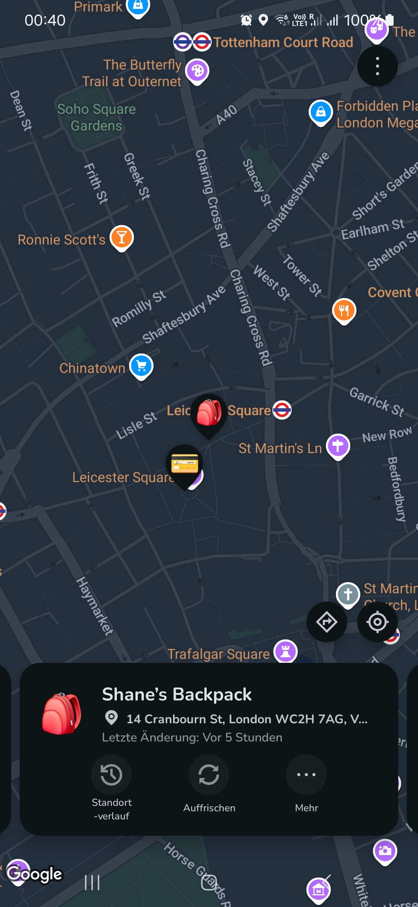

<h1>
    OpenTagViewer
</h1>

Apparently, this is the first ** Android App** to allow you to view/track your ** official Apple AirTags**.

I made this because I couldn't find any app or webpage that lets me do this
 
 

This project is a relatively polished looking Android/Java UI-wrapper around the Python [FindMy.py](https://github.com/malmeloo/FindMy.py) library, which is a derivative of the [openhaystack](https://github.com/seemoo-lab/openhaystack) project.

> [!WARNING]  
> This project is not afilliated with Apple Inc. or Android/Google LLC in any capacity

|Video Demo|Demo: ☀️ Light Mode|Demo: 🌑 Dark Mode|
|----|----|----|
| <video src="https://github.com/user-attachments/assets/d3857480-4ef0-48a9-ab63-8d8c15fd5314"> |||

(No, the location history in this demo isn't real)

## Features ⭐

- View current "live" location of your AirTags **on Android**
- Track & (automatically) save historical location history of your AirTags (a feature notably missing from the iOS FindMy apps!)
- UI customisation options

## How To Use 📖

### Requirements 🤓

1. An Android phone with [the `OpenTagViewer` app installed](https://github.com/parawanderer/OpenTagViewer/wiki/How-To:-Install-App)
2. A (free) [Apple Account](https://account.apple.com/) with 2FA enabled to be via either `SMS` or `Trusted Device`
3. One or more **AirTags**, which need to be already registered to some Apple account via the `FindMy` app
4. A Mac or a [MacOS Virtual Machine](https://github.com/parawanderer/OpenTagViewer/wiki/How-To:-Export-AirTags-From-Mac#prerequisites) of MacOS version `Sonoma (14)` or lower (only needed once/initially)

### How to view my AirTag on my Android Phone?!

See [📖 wiki](https://github.com/parawanderer/OpenTagViewer/wiki) for more details:

1. [Install the app](https://github.com/parawanderer/OpenTagViewer/wiki/How-To:-Install-App) and log in to your Apple Account
2. Create an export `.zip` file by following [this wiki guide](https://github.com/parawanderer/OpenTagViewer/wiki/How-To:-Export-AirTags-From-Mac#opentagviewer-macos-export-app--recommended)
3. Import the `.zip` file in the app
4. Profit: you can now track your AirTags on your Android Phone indefinitely!

-------------

## Contributing

Contributions/MRs are more than welcome.

Plenty of things can be improved in this project as it was mostly a "hackathony" thing I tried to throw together ASAP and make presentable for layusers.
Plenty of best practices haven't been followed, e.g. in the Testing & CI/CD setup.

**I think it would be nice if the app could support the following features:**

- [`🔴 BLOCKED due to 🐛Bug`](https://github.com/malmeloo/FindMy.py/issues/118) Locate Nearby AirTags using Low-Power Bluetooth & display the latest update in that case
- [`🔴 BLOCKED by 🙏Feature Request`](https://github.com/malmeloo/FindMy.py/issues/88) "Ring"/"Make Noise" button
- `🟡 Doable` Support showing unofficial "AirTags" created using [openhaystack](https://github.com/seemoo-lab/openhaystack)
- `🟠 Doable with enough effort` Integrate with projects that query **Google**'s/**Samsung**'s network and also show these in the same UI:
   - See [thread](https://github.com/malmeloo/FindMy.py/discussions/30), [thread](https://github.com/seemoo-lab/openhaystack/discussions/210) and repo [GoogleFindMyTools](https://github.com/leonboe1/GoogleFindMyTools). TL;DR: I think this (these two?) are separate projects with their own repos.
- `🟢 Easy` If you'd like to contribute a Language or make corrections in my Translations, feel free to do that too
    - Current list of languages can be found back [here](./app/src/main/res/xml/locales_config.xml), translation files can be found back at paths like [`./app/src/main/res/values-en/strings.xml`](./app/src/main/res/values-en/strings.xml) (replace `values-en` with `values-<your locale>`)

### Credits

- [UI Icons](https://fonts.google.com/icons?icon.query=warn&icon.set=Material+Icons) by Google
- [Material theme 3 library](https://github.com/material-components/material-components-android) + [colours](http://material-foundation.github.io?primary=%23F4FEFF&bodyFont=Nunito&displayFont=Nunito+Sans&colorMatch=false) by Google

### License: MIT

Do with it whatever you like, I don't really care :P
