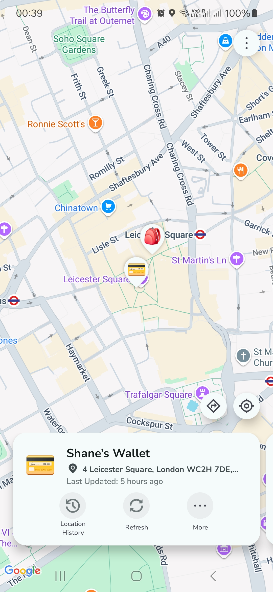
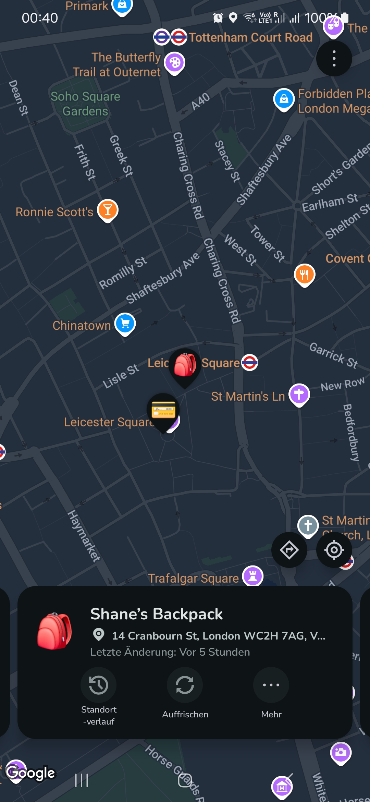

<h1>
    OpenTagViewer
</h1>

Apparently, this is the first ** Android App** to allow you to view/track your ** official Apple AirTags**.

I made this because I couldn't find any app or webpage that lets me do this
 
 

This project is a relatively polished looking Android/Java UI-wrapper around the Python [FindMy.py](https://github.com/malmeloo/FindMy.py) library, which is a derivative of the [openhaystack](https://github.com/seemoo-lab/openhaystack) project.

 

> [!WARNING]
> This project is not afilliated with Apple Inc. or Android/Google LLC in any capacity

|Video Demo|Demo: ☀️ Light Mode|Demo: 🌑 Dark Mode|
|----|----|----|
| <video src="https://github.com/user-attachments/assets/d3857480-4ef0-48a9-ab63-8d8c15fd5314"> |||

(No, the location history in this demo isn't real)

## Features ⭐

- View current "live" location of your AirTags **on Android**
- Track & (automatically) save historical location history of your AirTags (a feature notably missing from the iOS FindMy apps!)
- UI customisation options

## What it works with 🏷️

**The short version: if it shows up under _Items_ in Apple's own Find My app, it is in scope.**
AirTags are not a special case — they are just the most common thing in that list, and third-party
trackers that advertise "Works with Apple Find My" use the same network and the same keys.

| What | Works? | |
| --- | --- | --- |
| **AirTag** | ✅ Yes | What most people are here for |
| **Third-party trackers that work with Apple Find My** — Chipolo, Pebblebee, Mili MiTag, eufy and similar | ✅ Should work | Same network, same keys, nothing special about them. Not tested by the maintainers, who do not own any — [reports welcome](https://github.com/parawanderer/OpenTagViewer/issues) |
| **AirPods, and other Find My accessories** | ✅ Mostly | Works where Apple stores a usable key for it. Lightly tested |
| **Your own iPhone, iPad or Mac** | ✅ Yes | They are findable devices too, and appear alongside your tags |
| **Self-made tags** — [OpenHaystack](https://github.com/seemoo-lab/openhaystack), [Macless Haystack](https://github.com/dchristl/macless-haystack) | ⚠️ Exporter only | The exporter can package them; the app cannot read them yet ([#45](https://github.com/parawanderer/OpenTagViewer/issues/45)) |
| **A tag someone shared with you** through Apple's own sharing | ❌ No | Only the account that *owns* a tag can export it. Ask the owner to export it and send you the zip |
| **Tile, Samsung SmartTag, Google Find My Device trackers** | ❌ No | Different networks entirely, with nothing in common with Apple's. Out of scope |

> [!NOTE]
> This app reads Apple's Find My network. Anything not on that network cannot be tracked with it,
> no matter how similar the device looks.

## How To Use 📖

### Requirements 🤓

1. An Android phone with [the `OpenTagViewer` app installed](https://github.com/parawanderer/OpenTagViewer/wiki/How-To:-Install-App)
2. A (free) [Apple Account](https://account.apple.com/) with 2FA enabled to be via either `SMS` or `Trusted Device`
3. One or more **AirTags** — or any other tracker that appears under *Items* in Apple's `FindMy` app (see [what it works with](#what-it-works-with-)) — already registered to an Apple account you own
4. Any computer to run the exporter on — Windows, Linux or a Mac (only needed once/initially). See [the export guide](https://github.com/parawanderer/OpenTagViewer/wiki/How-To:-Export-AirTags#prerequisites)

### How to view my AirTag on my Android Phone?!

See [📖 wiki](https://github.com/parawanderer/OpenTagViewer/wiki) for more details:

1. [Install the app](https://github.com/parawanderer/OpenTagViewer/wiki/How-To:-Install-App) and log in to your Apple Account
2. Create an export `.zip` file by following [this wiki guide](https://github.com/parawanderer/OpenTagViewer/wiki/How-To:-Export-AirTags#the-export-wizard--recommended)
3. Import the `.zip` file in the app
4. Profit: you can now track your AirTags on your Android Phone indefinitely!

-------------

## Contributing

Contributions/MRs are more than welcome.

This started as a "hackathony" thing thrown together ASAP and made presentable for layusers,
and plenty can still be improved.

There are tests: Android unit and instrumented tests, tests for the Python bridge that talks
to Apple, and tests for the macOS export wizard. CI runs all of them, including the
instrumented tests on an emulator it provisions itself. New useful test contributions are welcome!

📋 **[CONTRIBUTING.md](./CONTRIBUTING.md)** covers getting set up — the JDK, the SDK, the Maps
API key, the git hook — and how to run every test suite: the Android unit and instrumented
tests, the Chaquopy bridge tests, and the desktop wizard tests, plus what CI runs and a few
offline diagnostic scripts that need no Apple account.

📐 **[AGENTS.md](./AGENTS.md)** is the rules a change has to satisfy — migrations, Anisette,
API keys, attribution. Written for automated contributors, but it applies to people too.

**I think it would be nice if the app could support the following features:**

- [`🔴 BLOCKED due to 🐛Bug`](https://github.com/malmeloo/FindMy.py/issues/118) Locate Nearby AirTags using Low-Power Bluetooth & display the latest update in that case
- [`🔴 BLOCKED by 🙏Feature Request`](https://github.com/malmeloo/FindMy.py/issues/88) "Ring"/"Make Noise" button
- `🟡 Doable` Support showing unofficial "AirTags" created using [openhaystack](https://github.com/seemoo-lab/openhaystack)
- `🟠 Doable with enough effort` Integrate with projects that query **Google**'s/**Samsung**'s network and also show these in the same UI:
   - See [thread](https://github.com/malmeloo/FindMy.py/discussions/30), [thread](https://github.com/seemoo-lab/openhaystack/discussions/210) and repo [GoogleFindMyTools](https://github.com/leonboe1/GoogleFindMyTools). TL;DR: I think this (these two?) are separate projects with their own repos.
- `🟢 Easy` If you'd like to contribute a Language or make corrections in my Translations, feel free to do that too
    - Current list of languages can be found back [here](./app/src/main/res/xml/locales_config.xml), translation files can be found back at paths like [`./app/src/main/res/values-en/strings.xml`](./app/src/main/res/values-en/strings.xml) (replace `values-en` with `values-<your locale>`)

### Credits

- [UI Icons](https://fonts.google.com/icons?icon.query=warn&icon.set=Material+Icons) by Google
- [Material theme 3 library](https://github.com/material-components/material-components-android) + [colours](http://material-foundation.github.io?primary=%23F4FEFF&bodyFont=Nunito&displayFont=Nunito+Sans&colorMatch=false) by Google

### License: MIT

Do with it whatever you like, I don't really care :P
