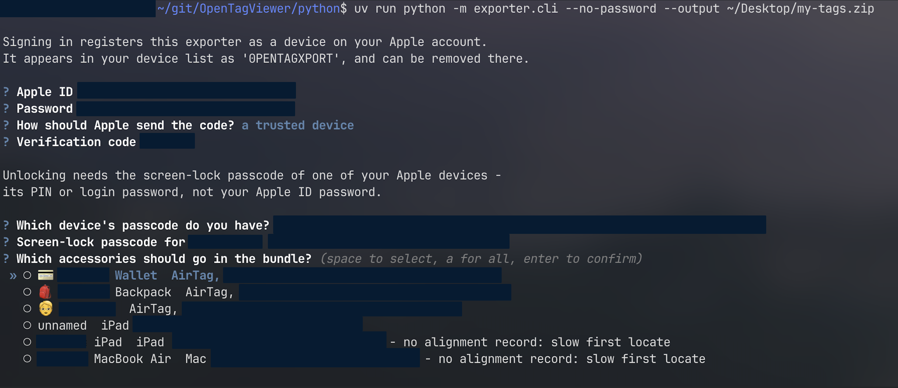

# How To: Export AirTags with the CLI

Export your AirTags from **iCloud**, into a zip the OpenTagViewer Android app imports.

**No Mac.** This replaces the [macOS export wizard](https://github.com/parawanderer/OpenTagViewer/wiki/How-To:-Export-AirTags-From-Mac)
route for anyone who does not have a Mac or a macOS VM: the same records the wizard reads out of
local files are read out of your iCloud account instead. It runs on macOS, Windows and Linux.

---

## Before you start

| You need | Notes |
| --- | --- |
| An **Apple ID with your AirTags on it** | The account that *owns* the tags. A tag shared to you through Apple's own sharing cannot be exported — see [Shared tags](#shared-tags-do-not-work). **Not needed on macOS 14 or older**, which reads its own files instead |
| Its **password** | Typed into this program. It is used once and never written anywhere. Not needed on macOS 14 or older |
| The **screen-lock passcode of one Apple device** on that account | An iPhone's PIN, or a Mac's login password. **Not** your Apple ID password. Not needed on macOS 14 or older |
| **Python 3.10 or newer** | If you use `uv` below it fetches a suitable one itself, so this matters only if you install by hand. macOS's built-in `python3` is 3.9 and will not do |
| Two-factor authentication by **SMS or a trusted device** | The only two this handles |

**You do not need** a Mac, an Apple device to hand, or an Apple Developer account. You do need to
have paired the tags with an iPhone or iPad at some point — that is how they got onto your account
in the first place, and nothing here changes it.

**Whoever you send the zip to needs a free Apple ID** and no Apple hardware at all. That is the
whole point of the exercise.

---

## 1. 📥 Get the code

There is no downloadable binary for the CLI yet — the [releases page](https://github.com/parawanderer/OpenTagViewer/releases)
carries the windowed exporter. Run this from a clone:

```bash
git clone https://github.com/parawanderer/OpenTagViewer.git
cd OpenTagViewer/python
```

## 2. 🔧 Install what it needs

With [uv](https://docs.astral.sh/uv/) — one command, and it picks the right Python itself:

```bash
uv sync
```

<details>
<summary><b>Q: Without uv?</b></summary>
<br>

`pip install -r <(uv export --no-dev)`, or install the four things `pyproject.toml` lists into a
virtualenv of your own. uv is only doing dependency resolution; nothing here needs it at runtime.
</details>

## 3. 🚀 Run it

> [!NOTE]
> **On a Mac running macOS 14 or older, steps 4 and 5 do not happen.** That Mac already has the
> records on disk, so the exporter reads those instead: no Apple ID, no password, no verification
> code, no device registered on your account. macOS asks for your login password twice — its own
> prompt, not this program's — and then you are at step 6.
>
> It picks that route by itself and says which it chose and why. `--source icloud` forces the long
> way if you want it; `--source local` asks for the short one, and is answered rather than obeyed
> where it cannot work.
>
> It is **not** an offline route, and this is worth being exact about: those local files got there
> because macOS signed into iCloud, joined your keychain's trust circle as a device and synced them
> down. It needs a signed-in Mac and it leaves *more* on your account than the iCloud route does —
> a full device peer and its escrow record, created by Apple's own software. What it genuinely
> saves you is typing your Apple ID password into this program.

```bash
uv run python -m exporter.cli --no-password --output my-tags.zip
```

> [!IMPORTANT]
> **Use `--no-password` for now.** The exporter locks bundles by default, and **no released
> version of the Android app can open a locked one** — its zip reader cannot decrypt anything. A
> locked bundle is unimportable until that lands. See [Locking the bundle](#locking-the-bundle).

## 4. 🔑 Sign in

It asks for your Apple ID and password, then — if your account has two-factor authentication, which
it almost certainly does — how you would like the code sent, and then the code.

> [!NOTE]
> **Signing in registers a device on your Apple account.** It appears in your device list as
> `0PENTAGXPORT`, which is deliberately not hardware-shaped so you can recognise it as software you
> installed. You can remove it there afterwards; removing it ends the session, so a later export
> signs in again.

## 5. 🔓 Unlock your keychain

Your tags' keys live in an encrypted iCloud keychain, and getting them out means recovering from
an **escrow record** — one per Apple device you have set up. The CLI lists them:

```
  1. Shane's iPhone, iPhone15,2, serial F2LX…, escrowed 2024-03-11
  2. Shane's MacBook Pro, MacBookPro18,3, serial C02Y…, escrowed 2023-08-02
```

Pick one with the arrow keys, then enter **that device's screen-lock passcode**. An iPhone's is its
unlock PIN; a Mac's is its login password.

> [!IMPORTANT]
> This is **not** your Apple ID password, and this step is where people get that wrong. If it is
> rejected, try the other device before assuming anything is broken.

**Nothing is written to your account here.** Recovery is a read: no new record is created and no
device joins your keychain's trust circle. Your passcode is used inside a single call and dropped.

## 6. 🏷️ Choose which tags to export



```
? What should go in the bundle?  (space to select, a for all, enter to confirm)
❯ ○ 🐈 cat                    AirTag, serial A02BCDEFG1AB, paired 2025-02-27
  ○ 🔑 keys                   AirTag, serial C91XZZQ44TAB, paired 2024-11-02 - no alignment record: slow first locate
  ○ unnamed                   AirPods (case), serial H4KLM0PQRS, paired 2023-06-14
```

An accessory you never named shows what it is instead: the kind, the serial Find My shows for it,
and when it was paired — which is often the one people recognise, because they remember buying it.
A third-party tag is named by its maker where the Bluetooth registry knows them, and where it does
not, the CLI prints the vendor id and where to look it up rather than guessing.

Move with the arrow keys, `space` to tick, `a` for all, `enter` when you are done. **Nothing is
ticked to begin with** — see the warning below for why that is deliberate rather than unhelpful.

> [!NOTE]
> Piping the CLI's output somewhere, or running it where there is no terminal, falls back to a
> numbered list you type numbers at. Same questions, same answers, no arrow keys.

> [!WARNING]
> **`a` selects everything, including your own devices.** If your selection includes an iPhone,
> iPad or Mac, the CLI names it and asks again before going on — a bundle holding your MacBook
> lets whoever receives it locate *you*, not a wallet, for as long as its keys are valid. Answer
> no and it drops the devices and keeps the tags.

> [!WARNING]
> **Exporting a tag cannot be undone.** The zip holds the tag's keys, and the only way to revoke
> them is to unpair the AirTag itself. Anyone who ends up with the file can locate that tag, from
> any Apple account, for as long as it stays paired. Apple's own sharing is revocable; **this is
> not that**. Export the tags you mean to hand over, not all of them out of habit.

Two things you may see:

- **"no alignment record"** — whoever imports that tag searches its whole key history the first
  time they locate it. That is minutes rather than seconds, and hundreds of requests to Apple. It
  is not an error, and there is nothing to do about it.
- **Your own iPhones, iPads and Macs in the list.** They are findable devices and live in the same
  place as your tags, so they come back from the same fetch. Where they carry key material they
  are exportable like anything else — **[observed]** on a real account, where an iPad and a MacBook
  Air both did. Whether the app can then usefully locate a Mac is untested; nothing stops you
  trying, and nothing here filters them out on a guess.
- **"Not exportable: … has no private key"** — a record with no key material. It cannot be located
  from an export, so it is set aside rather than silently dropped. Some of your own devices land
  here and some do not.

If a tag has no name on your account, you are asked to give it one. The app needs a name for every
tag, and inventing one for you would put a label on your data that you never chose.

## 7. 💾 Take the zip to your phone

Move `my-tags.zip` to your Android device however you like, and import it:
[How To: Import Export Zip In App](https://github.com/parawanderer/OpenTagViewer/wiki/How-To:-Import-Export-Zip-In-App).

---

## Adding tags that were never in an Apple account

DIY tags — OpenHaystack, Macless Haystack — are not in iCloud, so they are read from a file:

```bash
uv run python -m exporter.cli --no-password --add-keys ~/tags/bike.keys --output my-tags.zip
```

Repeat `--add-keys` for as many files as you have. Four formats are read:

| Format | What it looks like |
| --- | --- |
| Macless Haystack `devices.json` | a JSON array with `privateKey` and `additionalKeys` |
| FindMy.py's own accessory JSON | `{"type": "custom_rolling_key_accessory", …}` |
| OpenHaystack `.keys` files | `Private key: …` / `Advertisement key: …` lines |
| A plain list of keys | one base64 or hex key per line, `#` comments allowed |

You are asked to name each one, with a suggestion derived from the tag's *public* key — the value
it broadcasts anyway. If a file states its advertisement key, the CLI checks that the private key
actually produces it, which catches the two fields being the wrong way round.

### Exporting only these, with no Apple account

Add `--source none` and nothing is signed into:

```bash
uv run python -m exporter.cli --source none --no-password --add-keys ~/tags/bike.keys -o my-tags.zip
```

The command above asks one question — what to call the tag — and writes the zip. Without it, the
run reads an account first: an Apple ID password, a device registered on your account, and a
screen-lock passcode, in order to fetch a list nothing is going to be taken from. A tag you
generated yourself was never in an Apple account and does not need one to leave.

`--source none` refuses to run without at least one `--add-keys` file, since there would be
nothing at all to put in the bundle. In the window, this is simply what happens: it opens with an
empty list, and *+ Add from key file…* sits next to *Sign in to Apple…* rather than behind it.

> [!NOTE]
> **The app cannot import these yet.** They go into the bundle as `CustomAccessories/*.json`, which
> today's importer skips. The bundle also declares format `0.0.3` when it holds one, so a future
> importer can tell.

---

## Locking the bundle

Leave `--no-password` off and the zip is encrypted with AES-256 and a generated 12-character code,
printed once:

```
  The code for this bundle is:  H4K2-9WMR-7TQX
```

**Send the code separately from the file.** The threat this defends against is the zip sitting in a
mail archive or a cloud backup years from now — and a code sent in the same message is in the same
backup as the file. Say it out loud, or text it, but not alongside the zip.

The code is not stored anywhere and cannot be recovered. It is 12 characters rather than a short
PIN because the zip format fixes its key derivation at something weak enough that a 6-digit code
would fall in seconds.

---

## Options

| Option | What it does |
| --- | --- |
| `-o`, `--output` | Where to write. Defaults to a timestamped zip in the current directory |
| `--no-password` | Write a plain zip. Required for any released version of the app |
| `--add-keys FILE` | Add a self-generated tag from a key file. Repeatable |
| `--source-user` | What the recipient sees as "exported by". Defaults to your machine's username |
| `--accept-terms` | Agree to pending iCloud terms without displaying them |
| `--source` | `auto` (the default), `icloud`, `local` or `none`. `auto` reads this Mac's own files where it can; `none` reads no account at all, for a bundle of nothing but `--add-keys` tags |
| `--anisette-url` | Use a remote Anisette server instead of running one locally |
| `--anisette-libs` | Cache Apple's ADI libraries in a file, so a later run does not download them |
| `-v`, `--verbose` | Show what the library is doing. Worth having on the first run |
| `-vv` | Everything, including the CloudKit and keychain protocol steps. This is what to send with a bug report — **read the warning below first** |

> [!CAUTION]
> **Read `-v` and `-vv` output before you paste it anywhere, and strip anything that identifies
> you.** It is written for debugging, not for publishing, and it names real things:
>
> - **Your devices, by name, model and serial number.** Escrow records are described the way a
>   person recognises them, so "Paula's iPhone, iPhone14,2, serial F2L…" is a normal line.
> - **Keychain item attributes, verbatim.** The account and label fields are printed as they are
>   stored, and what is in them is Apple's choice rather than this program's.
> - **Peer identifiers** for every device in your account's trust circle. Pseudonymous, but stable
>   and unique to you.
>
> No key material, passcode or password is logged, and payloads appear only as byte counts. But
> **this cannot promise a given identifier never reaches the output** — the text comes from a
> library reading Apple's structures, and a field that is innocuous on one account may not be on
> another. So the check is yours to make, every time, before it goes in an issue.

---

## Running it from a script

**Sign in by hand once first.** The first run registers this machine as a device on your Apple
account and remembers it, so later runs usually go straight through without a verification code.
Until that has happened, no amount of flags will make it unattended — a code is sent to your
phone and something has to type it.

After that, every other answer can be given up front:

```shell
export OPENTAGVIEWER_APPLE_PASSWORD='...'
export OPENTAGVIEWER_DEVICE_PASSCODE='...'

uv run python -m exporter.cli \
  --non-interactive \
  --apple-id me@example.com \
  --device F2LX9Q \
  --all-tags \
  --no-password \
  --output tags.zip
```

`--non-interactive` is the one that matters. Without it a missing answer is *prompted for*, and a
scheduled job sits waiting on a keystroke that never arrives — no error, no output, no end. With
it, the run fails and names the question it wanted to ask.

### Where to put the password

**There is no `--password` flag and there will not be one.** Anything on a command line is
readable by every other user on the machine through `ps`, and it lands in your shell history.

Worst last:

| | |
| --- | --- |
| **A file, or a pipe** | `--password-file secret.txt`, or `--password-file -` to read one line from standard input. Nothing in `ps`, nothing in the environment, nothing in history. The file must not be readable by other users — `chmod 600` it, or the run refuses it |
| **An environment variable** | `OPENTAGVIEWER_APPLE_PASSWORD` and `OPENTAGVIEWER_DEVICE_PASSCODE`. Fine in a CI secret store. Weaker than a file: on Linux another process of yours can read `/proc/<pid>/environ`, it is inherited by every child, and setting it inline on a command puts it in history anyway |
| **Being asked** | What happens when neither is given |

If you use a variable, set it from something that is not itself the secret — a secret store, or
`read -s`, not a literal in a checked-in script. In most shells, prefixing a command with a space
also keeps it out of history.

### The other flags

| Option | |
| --- | --- |
| `--apple-id` | Sign in as this, instead of being asked |
| `--password-file` | Read the Apple ID password from a file, or `-` for standard input |
| `--passcode-file` | The same, for the device screen-lock passcode |
| `--device SERIAL` | Unlock with this device's escrow record instead of choosing from a list. Fails, listing what is available, if nothing matches |
| `--all-tags` | Export everything found, instead of choosing |
| `--include-my-devices` | Let `--all-tags` include your own iPhones, iPads and Macs. **Never implied** |
| `--non-interactive` | Fail rather than ask |

> [!WARNING]
> **`--all-tags` leaves your own devices out on purpose.** "All my tags" and "all my tags plus the
> laptop I am sitting at" are different requests, and a bundle holding your MacBook lets whoever
> receives it locate *you*. Interactively the CLI names each device and asks again; a scheduled run
> has nobody to ask, so it takes the safe half and prints what it left out.

Exit codes: `0` if everything asked for was exported, `1` if not — including the case where a
bundle *was* written but the account could not be read, which is worth checking for rather than
assuming a file on disk means success.

---

## What travels in the bundle, and what does not

**In it:** each tag's keys, its name and emoji, its battery level, model and hardware identifiers,
and `sourceUser` — by default your machine's username, which is shown to whoever imports it as
"exported by". Change it with `--source-user` if that is not a name you want to send.

**Not in it:** your Apple ID, your password, your passcode, any session token, and your home and
work addresses. That last one is not an accident: Apple stores named locations in the same place as
your tags, and they are never decrypted here.

**On disk afterwards:** nothing. No account file, no cached keys. FindMy.py's own example scripts
save your account — password included — to `account.json`; this deliberately does not.

---

## When it does not work

**"Signing in got as far as your account and then stopped"** — usually unaccepted iCloud terms.
Apple takes agreement on one of its own devices or on iCloud.com and nowhere else, so the CLI
offers to show them here: the documents are rendered as plain text and opened in your pager, one
at a time, and nothing is sent unless you type `ACCEPT` for the document you just read. Press `q`
to leave the pager.

Anything other than `ACCEPT` stops, and your account is unchanged. `--accept-terms` agrees to them
all without displaying them, for a run nobody is watching — it is still a contract, so it is opt-in
rather than the default.

> [!NOTE]
> Which error means "terms pending" is not established, so the CLI prints what Apple actually said
> and then offers rather than assuming. If the message is about something else, accepting terms
> will not fix it.

**"No record on this account can currently be recovered from"** — either the account has no device
enrolled that can be recovered from, or the service is having a bad day. The CLI tells you which of
those it thinks it is. Worth retrying later before concluding anything.

**The passcode is rejected** — check you are using the *device's* screen-lock passcode and not your
Apple ID password, then try a different device from the list.

**It takes a long time on one tag** — a tag with no alignment record searches its entire key
history. Expected, and unavoidable from this side.

### Shared tags do not work

A tag someone shared with you through Apple's own sharing shows up in Find My on an iPhone, and
this route can even see that the share exists — but a shared record **carries no key material**, so
there is nothing to export. Only the owner of a tag can export it. See
[export-modes.md](./export-modes.md) for what it would take to change that.

---

## What this leaves on your Apple account

**One entry in your device list**, if you used the iCloud route. Signing in registers a device,
and Apple shows it wherever you look at your devices — Settings on an iPhone, System Settings on a
Mac, or appleid.apple.com:

| | |
| --- | --- |
| Model | **MacBook Pro** (`MacBookPro18,3`) |
| Version | **macOS 13.4.1** |
| Serial Number | **`0PENTAGXPORT`** |

**It is not a Mac and you do not own one of these.** The model and OS come from FindMy.py, which
has always presented itself as a MacBook Pro and authenticates fine that way; the serial is this
exporter's, chosen to be legible and deliberately implausible as real hardware. That serial is the
part to recognise it by — `0PENTAGXPORT` is the exporter, and `0PENTAGVIEWR` is the Android app if
you also use that.

**It is one entry, not one per export.** The identity is stable, so running this again reuses it.

**You can remove it, and you do not need an Apple device to do it.** Sign in at
[account.apple.com](https://account.apple.com), open **Devices**, pick the entry, and choose
**Remove from Account**. Apple's own instructions name Windows, Android and "don't have any Apple
devices" as exactly the case that page is for —
[View and remove your devices](https://support.apple.com/en-us/118412),
[Check your Apple Account device list](https://support.apple.com/en-us/102649).

Nothing here depends on the entry surviving: a later export signs in again and it comes back.
Removing it ends that session, which is the point of removing it.

> [!NOTE]
> **On macOS 14 or older, this does not happen** — nothing signs in, so nothing is registered.
> Anything already in your device list there is your Mac's own doing, from when it signed into
> iCloud, and removing it is a different decision entirely.

---

## Related

- [How To: Export AirTags From Mac](https://github.com/parawanderer/OpenTagViewer/wiki/How-To:-Export-AirTags-From-Mac) — the older route, which still works and still needs a Mac
- [How To: Import Export Zip In App](https://github.com/parawanderer/OpenTagViewer/wiki/How-To:-Import-Export-Zip-In-App)
- [export-modes.md](./export-modes.md) — which flows exist, and which of them write to your account
- [findmy-export/](./findmy-export/) — the protocol underneath all of this
