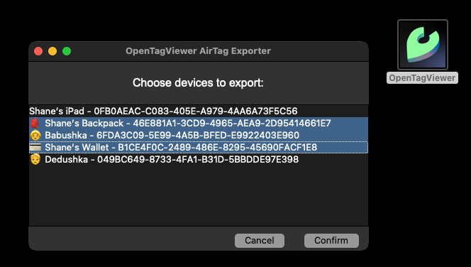

# 🧙 OpenTagViewer AirTag Exporter

Gets your AirTags out of Apple's Find My into a zip the OpenTagViewer Android app can import.

Two ways in, same output:

| | |
| --- | --- |
| **The window** — `exporter/wizard.py` | tick the tags you want, choose where to save |
| **The CLI** — `exporter/cli.py` | the same thing without a window, on a machine with no screen |

And two ways of getting the data, chosen for you:

| | When | What it asks for |
| --- | --- | --- |
| **This Mac's own files** | macOS 14 or older, signed into iCloud | your macOS login password, twice, in macOS's own dialog |
| **iCloud** | everything else — Windows, Linux, macOS 15+ | your Apple ID and password, a verification code, and the screen-lock passcode of one device on the account |

**The Mac is no longer required.** It used to be: the exporter read the plists Find My leaves on
disk, which is why this project ships a VM bootstrap. It reads the same records out of iCloud now,
so it runs anywhere — and where a Mac *can* still read them locally, it does, because that asks for
less.

📖 **[Full instructions, with what each step means and what it leaves behind](../docs/how-to-export-with-the-cli.md)**



---

## Running it

Dependencies are managed with [uv](https://docs.astral.sh/uv/), which fetches a suitable Python
itself — you do not need one installed:

```shell
cd python
uv sync
```

Then either:

```shell
uv run python -m exporter.wizard    # the window
uv run python -m exporter.cli       # the same thing in a terminal
uv run python -m exporter.cli --help
```

> [!IMPORTANT]
> **Pass `--no-password` to the CLI for now**, or use the window, which does not lock bundles.
> The CLI encrypts by default and no released version of the Android app can open an encrypted
> zip — its reader cannot decrypt anything. See
> [the handover doc](../docs/android-import-handover.md).

**tkinter** is what draws the window, and it is not part of a stock Python on macOS or Linux:

```shell
brew install python-tk          # macOS
sudo apt install python3-tk     # Debian/Ubuntu
```

Windows ships it with the interpreter. The released binaries bundle it either way; this only
matters when running from source.

### Adding tags that were never in an Apple account

OpenHaystack and Macless Haystack tags are not in iCloud, so they come from a file: the **+ Add
from key file…** button in the window, or `--add-keys` on the CLI. Four formats are read — see the
[full instructions](../docs/how-to-export-with-the-cli.md#adding-tags-that-were-never-in-an-apple-account).

---

## What an export leaves on your Apple account

**Nothing, on macOS 14 or older**: that route reads files macOS already keeps and never signs in.

Everywhere else, signing in registers a device, and it appears in your Apple device list as a
**MacBook Pro** (`MacBookPro18,3`) running **macOS 13.4.1**, serial number **`0PENTAGXPORT`**.

**You do not own that Mac.** The model and OS come from FindMy.py, which presents itself as one and
authenticates fine that way; the serial is this exporter's own, and is what makes the entry
recognisable rather than something you are invited to remove because you cannot place it.

One entry rather than one per export — the identity is stable. Remove it whenever you like at
[account.apple.com](https://account.apple.com) → **Devices** → **Remove from Account**, which works
in any browser and needs no Apple device. A later export signs in again.

---

## 🔧 airtag_decryptor.py

The macOS-local decryption on its own, as a script. Based on
[airtag-decryptor.swift](https://gist.github.com/airy10/5205dc851fbd0715fcd7a5cdde25e7c8) by
[airy10](https://gist.github.com/airy10), itself based on
[Matus's version](https://gist.github.com/YeapGuy/f473de53c2a4e8978bc63217359ca1e4).

**macOS 14 or older only** — 15 tightened keychain access so the `BeaconStore` key cannot be read.

```shell
uv run python -m exporter.airtag_decryptor --rename-legacy
```

Default output path is `~/plist_decrypt_output`. `--rename-legacy` handles the macOS 11 folder
name ([issue #24](https://github.com/parawanderer/OpenTagViewer/issues/24)) and does nothing on
later versions.

<details>
<summary><b>Q: How to provide a custom output path?</b></summary>
<br>

```shell
uv run python -m exporter.airtag_decryptor --rename-legacy --path='/your/alternative/path'
```
</details>

<details>
<summary><b>Q: How to provide a custom decryption key?</b></summary>
<br>

If you got the `BeaconStore` key some other way — on macOS 15 via
[this approach](https://github.com/pajowu/beaconstorekey-extractor), say — pass it as a
**[Base64](https://www.base64encode.org/)** string:

```shell
uv run python -m exporter.airtag_decryptor --rename-legacy --key='SGVsbG8gV29ybGQ='
```
</details>

<details>
<summary><b>Q: What other options are there?</b></summary>
<br>

```shell
uv run python -m exporter.airtag_decryptor --help
```
</details>

---

## 🧑‍💻 Development

```shell
uv sync
uv run pytest ./test ./opentagviewer_export
uv run flake8 . --count --select=E9,F63,F7,F82 --show-source --statistics
uv run pyright ./exporter ./opentagviewer_export
```

**Both test paths.** `test/` covers the exporter — which route it takes, what it does with the
records, what the CLI decides. `opentagviewer_export/tests/` covers the shared package that writes
the bundle, which the Android app depends on too; its strongest test rebuilds the committed export
fixtures **byte for byte**, so a change in how a record is serialised fails there rather than on
somebody's phone.

Signing in and everything downstream of it are not covered, because they need a real Apple account.
Everything that happens to the records afterwards is.

### What is where

| | |
| --- | --- |
| `exporter/wizard.py` | the window, and nothing else — every decision it makes lives below |
| `exporter/cli.py` | the same flow in a terminal |
| `exporter/source.py` | which route this machine takes, and why |
| `exporter/icloud.py` | sign in, unlock the keychain, fetch, render records |
| `exporter/localsource.py` | the same records from this Mac's own files |
| `exporter/custom_tags.py` | OpenHaystack-style tags, from a key file to a bundle entry |
| `opentagviewer_export/` | **the shared writer.** The bundle format, and the only implementation of it — the Android app uses this too |

### Build the icons (macOS)

```shell
./make_icon.sh
```

`OpenTagViewer.ico` is the Windows icon, generated from the same iconset — see the release
workflow.

### Build an executable

PyInstaller, on the platform you are building for: it cannot cross-compile, which is why the
release workflow runs a job per platform.

```shell
uv sync --no-default-groups --group build

uv run pyinstaller --onefile --windowed --name "OpenTagViewer" \
    --osx-bundle-identifier "dev.wander.opentagviewer" \
    --icon=OpenTagViewer.icns --collect-all unicorn --noconfirm ./exporter/wizard.py
```

Windows uses `--icon=OpenTagViewer.ico`; Linux takes neither `--windowed` nor an icon.

> [!IMPORTANT]
> **`--collect-all unicorn` is not optional.** unicorn loads its native library through ctypes at
> runtime, so PyInstaller never sees it: without this the build succeeds and the binary dies at
> startup with *Failed to load the Unicorn dynamic library*. Always run the result once —
> `./dist/OpenTagViewer --version` — because that is the only thing that catches it.

The result is around **34 MB** as a binary, **68 MB** zipped, against 22 MB for the macOS-only
1.0.5. Almost all of the difference is unicorn, at 41 MB on disk: it emulates Apple's ADI library
so that signing in works without a third-party Anisette server. Excluding the Bluetooth stack
FindMy.py brings in saves 1.6 MB, which is not worth the failure mode it introduces.

### Versioning

`VERSION` in [`exporter/version.py`](./exporter/version.py) is the only place the exporter's
version is written. It reaches the window title and every export it produces, as
`via: <producer>:<version>` in `OPENTAGVIEWER.yml` — which is how a zip is traced back to what
built it.

**There is more than one producer.** The window stamps `OpenTagViewer.wizard:<version>`, the CLI
stamps `OpenTagViewer.cli:<version>`, and the Android app will stamp its own. They share `VERSION`
because they ship together; the name in front of it is what makes a bug report answerable.

Nothing patches it at build time, so **bump it in a commit before tagging**. Releases are tagged
`exporter-v<version>` (`macos-exporter-v` still resolves), and CI refuses to publish one whose tag
disagrees:

```shell
python ../scripts/release_version.py --kind exporter --print
python ../scripts/release_version.py --kind exporter --tag exporter-v1.1.1
```

Not to be confused with `EXPORT_FORMAT_VERSION` in `opentagviewer_export/bundle.py`: that is the
version of the *bundle format* the Android app parses, and it changes only when the contents of
the zip change. Full procedure:
[CONTRIBUTING.md](../CONTRIBUTING.md#releasing-the-exporter).
