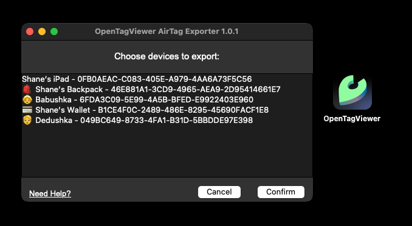

# 🧙 OpenTagViewer MacOS AirTag Export Wizard

A very simple GUI-based utility that allows users to select which AirTags to export `.plist` files for, 
to be able to then import them in the OpenTagViewer Android App.

The wizard will generally show you the most recent names for your devices.
These names can be set using the FindMy app on MacOS or iOS devices.

The UI is pretty plain looking, but ideally this tool only needs to be used once/rarely! 😀

Get the latest version of it [here](https://github.com/parawanderer/OpenTagViewer/releases?q=macos-exporter&expanded=true)




Tested/Developed on:
```
ProductName:            macOS
ProductVersion:         14.7.4
BuildVersion:           23H420
```

## 🔧 Python Utility Scripts


## airtag_decryptor.py

This is an implementation based on [airtag-decryptor.swift](https://gist.github.com/airy10/5205dc851fbd0715fcd7a5cdde25e7c8)
by [airty10](https://gist.github.com/airy10), which was based on [airtag-decryptor.swift by Matus](https://gist.github.com/YeapGuy/f473de53c2a4e8978bc63217359ca1e4),
but in python.

Reasoning for this: I don't know Swift (and I don't even use MacOS) and I need to copy the logic into an UI app for MacOS for my android OpenTagViewer app.

### How to use:

- You need [python3 and pip](https://packaging.python.org/en/latest/tutorials/installing-packages/)
- Clone the repo and `cd` into this directory
- Install requirements:
    ```bash
    pip install -r requirements.txt
    ```
- **(OPTIONAL)** Change your output path on [airtag-decryptor.py:30](https://github.com/parawanderer/OpenTagViewer/blob/main/scripts/airtag-decryptor.py#L30) if wanted
    - Default output path: `~/plist_decrypt_output`
- Run the script:
    ```bash
    python airtag_decryptor.py
    ```
    - Note that it will prompt your password twice.
- The script will open the specified output folder on success


## 🧑‍💻 Export Wizard Development

### (Dev) Run it as a python script on MacOS

You need `python` and `tkinter` installed:
```shell
brew install python3
brew install python-tk

pip install -r requirements.txt
```

Then:
```shell
python wizard.py
```

### Build executable (on MacOS)

You will need to install `pyinstaller`:

```shell
pip install pyinstaller
```

Then you can build a distribution for the app:

```shell
pyinstaller \
    --onefile \
    --windowed \
    --name "OpenTagViewer" \
    --osx-bundle-identifier "dev.wander.opentagviewer" \
    --icon=OpenTagViewer.icns \
    wizard.py
```

